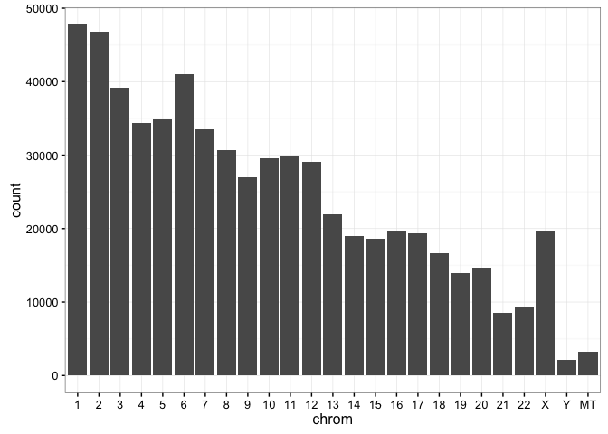

# Demo_23andMe_Risk

### This is to compare my 23andMe raw data to the GWAS studies

For a particular disease, I am comparing my SNPs to those shown in GWAS studies.

(note: **DON'T Freak Out** if your SNPs match the diseased SNPs, because the chance of having that disease is still low. How low?  That's my ongoing side project.)

#### download bioconductor

```r
# source("https://bioconductor.org/biocLite.R")
# biocLite("gwascat")
# biocLite("TxDb.Hsapiens.UCSC.hg19.knownGene") # my 23andMe uses hg19 or "reference human assembly build 37"
# biocLite("org.Hs.eg.db")
# biocLite("IRanges")
# Check out 'GenomicFeatures' functions:
# browseVignettes("GenomicFeatures")
# browseVignettes("GenomicRanges")
```


```r
library(gwascat)
```

```
## Loading required package: Homo.sapiens
```

```
## Loading required package: AnnotationDbi
```

```
## Loading required package: stats4
```

```
## Loading required package: BiocGenerics
```

```
## Loading required package: parallel
```

```
## 
## Attaching package: 'BiocGenerics'
```

```
## The following objects are masked from 'package:parallel':
## 
##     clusterApply, clusterApplyLB, clusterCall, clusterEvalQ,
##     clusterExport, clusterMap, parApply, parCapply, parLapply,
##     parLapplyLB, parRapply, parSapply, parSapplyLB
```

```
## The following objects are masked from 'package:stats':
## 
##     IQR, mad, xtabs
```

```
## The following objects are masked from 'package:base':
## 
##     anyDuplicated, append, as.data.frame, cbind, colnames,
##     do.call, duplicated, eval, evalq, Filter, Find, get, grep,
##     grepl, intersect, is.unsorted, lapply, lengths, Map, mapply,
##     match, mget, order, paste, pmax, pmax.int, pmin, pmin.int,
##     Position, rank, rbind, Reduce, rownames, sapply, setdiff,
##     sort, table, tapply, union, unique, unsplit
```

```
## Loading required package: Biobase
```

```
## Welcome to Bioconductor
## 
##     Vignettes contain introductory material; view with
##     'browseVignettes()'. To cite Bioconductor, see
##     'citation("Biobase")', and for packages 'citation("pkgname")'.
```

```
## Loading required package: IRanges
```

```
## Loading required package: S4Vectors
```

```
## 
## Attaching package: 'S4Vectors'
```

```
## The following objects are masked from 'package:base':
## 
##     colMeans, colSums, expand.grid, rowMeans, rowSums
```

```
## Loading required package: OrganismDbi
```

```
## Loading required package: GenomicFeatures
```

```
## Loading required package: GenomeInfoDb
```

```
## Loading required package: GenomicRanges
```

```
## Loading required package: GO.db
```

```
## 
```

```
## Loading required package: org.Hs.eg.db
```

```
## 
```

```
## Loading required package: TxDb.Hsapiens.UCSC.hg19.knownGene
```

```
## Warning: replacing previous import 'ggplot2::Position' by
## 'BiocGenerics::Position' when loading 'ggbio'
```

```
## gwascat loaded.  Use data(ebicat38) for hg38 coordinates;
```

```
##  data(ebicat37) for hg19 coordinates.
```

```r
library(ggplot2)
filepath = '/Users/changc25/Desktop/gdata.txt'
d <- read.table(filepath,
                sep="\t", header=FALSE,
                colClasses=c("character", "character", "numeric", "character"),
                col.names=c("rsid", "chrom", "position", "genotype"))

d$chrom = ordered(d$chrom, levels=c(seq(1, 22), "X", "Y", "MT"))
```

#### Take a look at SNP count at each chromosome

```r
ggplot(d) + geom_bar(aes(chrom)) + theme_bw()
```

<!-- -->

#### Comparing my SNPs to the GWAS studies

```r
# note, since my 23andMe uses hg19 or "reference human assembly build 37", we need to look for data that are annotated by hg19
data("gwrngs19")
gwrngs.emd <- as.data.frame(elementMetadata(gwrngs19))  
dm <- merge(d, gwrngs.emd, by.x="rsid", by.y="SNPs") # merging my data with gwrngs19, based on the SNPs ID

risk.alleles <- gsub("[^\\-]*-([ATCG?])", "\\1", dm$Strongest.SNP.Risk.Allele) # find the allele genotype (single character)
# flag 'i.have.risk' as TRUE if my one of my SNPs overlaps with the GWAS study 
i.have.risk <- mapply(function(risk, mine) {
  risk %in% unlist(strsplit(mine, ""))
}, risk.alleles, dm$genotype)
dm$i.have.risk <- i.have.risk

# create a new dataframe containing those 'risky' SNPs
my.risk <- dm[dm$i.have.risk, ]
rel.cols <- c(colnames(d), "Disease.Trait", "Strongest.SNP.Risk.Allele", "Risk.Allele.Frequency", "p.Value", "i.have.risk", "OR.or.beta")
```


#### Print out my No.1 risky SNPs, which is sorted based on the frequency in that disease population

```r
head(my.risk[order(my.risk$Risk.Allele.Frequency), rel.cols], 1)
```

```
##           rsid chrom  position genotype
## 395 rs10490924    10 124214448       GT
##                             Disease.Trait Strongest.SNP.Risk.Allele
## 395 Age-related macular degeneration (GA)              rs10490924-T
##     Risk.Allele.Frequency p.Value i.have.risk OR.or.beta
## 395                  .206   7e-47        TRUE       2.52
```

#### _what are Risk.Allel.Frequency and OR.or.beta? Are those number significant?_
well... I still need to review more literatures since I wasn'. I will get back to this soon!
Or if you know this answer, please comment below. Really appreciate!


#### How about other diseases, for instance, **Rheumatoid Arthritis**?

#### First, let's take a look at all the studies related to 'rheuma...'

```r
d_list = grep("rheuma", dm$Disease.Trait, ignore.case=TRUE, value=TRUE) 
unique(d_list)
```

```
## [1] "Celiac disease and Rheumatoid arthritis"                 
## [2] "Rheumatoid arthritis"                                    
## [3] "Response to TNF-alpha inhibitors in rheumatoid arthritis"
## [4] "Response to tocilizumab in rheumatoid arthritis"         
## [5] "Response to anti-TNF treatment in rheumatoid arthritis"
```

#### I am interested in 'rheumatoid arthritis'


```r
# search Disease.Trait column for the word "Rheuma" and isn't case sensitive
rows_disease = grepl("rheumatoid arthritis", dm$Disease.Trait, ignore.case=TRUE) 
# since I am Asian, I only want to compare my SNPS to those studies done on Asian populations
rows_asian = grepl("Asian", dm$Initial.Sample.Size, ignore.case = TRUE) 
# in the matched data "dm", look for diseases that match above two selections
my_asian_disease_data = dm[rows_disease & rows_asian,] 

# select rwos that also contain Asian sample
my_asian_disease_data[c('rsid','genotype','Strongest.SNP.Risk.Allele','num.Risk.Allele.Frequency','OR.or.beta','PUBMEDID')]
```

```
##             rsid genotype Strongest.SNP.Risk.Allele
## 962   rs10985070       CC              rs10985070-C
## 963   rs10985070       CC              rs10985070-C
## 1308  rs11574914       GG              rs11574914-A
## 1309  rs11574914       GG              rs11574914-A
## 1567  rs11889341       CT              rs11889341-T
## 1568  rs11889341       CT              rs11889341-T
## 1569  rs11889341       CT              rs11889341-T
## 2461  rs13330176       AA              rs13330176-A
## 2462  rs13330176       AA              rs13330176-A
## 3863   rs1893592       AA               rs1893592-A
## 3943   rs1980422       TT               rs1980422-C
## 3944   rs1980422       TT               rs1980422-C
## 4511    rs227163       TT                rs227163-C
## 4642   rs2301888       AA               rs2301888-G
## 4643   rs2301888       AA               rs2301888-G
## 4644   rs2301888       AA               rs2301888-G
## 4830   rs2476601       GG               rs2476601-A
## 5030   rs2671692       AA               rs2671692-A
## 5464   rs3087243       AG               rs3087243-G
## 5468   rs3087243       AG               rs3087243-G
## 5655  rs34536443       GG              rs34536443-G
## 5921   rs3806624       GG               rs3806624-G
## 5923   rs3806624       GG               rs3806624-G
## 6187   rs4239702       CT               rs4239702-C
## 6188   rs4239702       CT               rs4239702-C
## 6322   rs4409785       TT               rs4409785-C
## 6324   rs4409785       TT               rs4409785-C
## 7342    rs624988       TT                rs624988-T
## 7590    rs657075       GG                rs657075-A
## 7591    rs657075       GG                rs657075-A
## 8097    rs706778       --                rs706778-T
## 8098    rs706778       --                rs706778-T
## 9121   rs8026898       GG               rs8026898-A
## 9122   rs8026898       GG               rs8026898-A
## 9752    rs947474       AA                rs947474-A
## 9753    rs947474       AA                rs947474-A
## 9901   rs9653442       CT               rs9653442-C
## 9902   rs9653442       CT               rs9653442-C
## 10120   rs998731       TT                rs998731-T
## 10121   rs998731       TT                rs998731-T
##       num.Risk.Allele.Frequency OR.or.beta PUBMEDID
## 962                        0.45       1.08 24390342
## 963                        0.42       1.09 24390342
## 1308                       0.26       1.12 24390342
## 1309                       0.33       1.13 24390342
## 1567                       0.30       1.16 24390342
## 1568                       0.25       1.13 24390342
## 1569                       0.23       1.12 24390342
## 2461                       0.23       1.12 24390342
## 2462                       0.30       1.12 24390342
## 3863                       0.73       1.11 24390342
## 3943                       0.24       1.13 24390342
## 3944                       0.19       1.12 24390342
## 4511                       0.42       1.11 24390342
## 4642                       0.41       1.19 24390342
## 4643                       0.58       1.13 24390342
## 4644                       0.65       1.11 24390342
## 4830                       0.09       1.80 24390342
## 5030                       0.52       1.07 24390342
## 5464                       0.55       1.15 24390342
## 5468                       0.60       1.14 24390342
## 5655                       0.95       1.46 24390342
## 5921                       0.56       1.08 24390342
## 5923                       0.46       1.08 24390342
## 6187                       0.69       1.13 24390342
## 6188                       0.72       1.14 24390342
## 6322                       0.17       1.12 24390342
## 6324                       0.15       1.12 24390342
## 7342                       0.40       1.09 24390342
## 7590                       0.35       1.12 24390342
## 7591                       0.17       1.09 24390342
## 8097                       0.45       1.10 24390342
## 8098                       0.40       1.12 24390342
## 9121                       0.27       1.15 24390342
## 9122                       0.21       1.15 24390342
## 9752                       0.81       1.12 24390342
## 9753                       0.83       1.11 24390342
## 9901                       0.46       1.11 24390342
## 9902                       0.46       1.12 24390342
## 10120                      0.56       1.08 24390342
## 10121                      0.44       1.09 24390342
```

All the SNPs are reported from the same literature, PUBMED 24390342.
#### How likely am I having Rheumatoid Arthritis?

### To be continued ...
